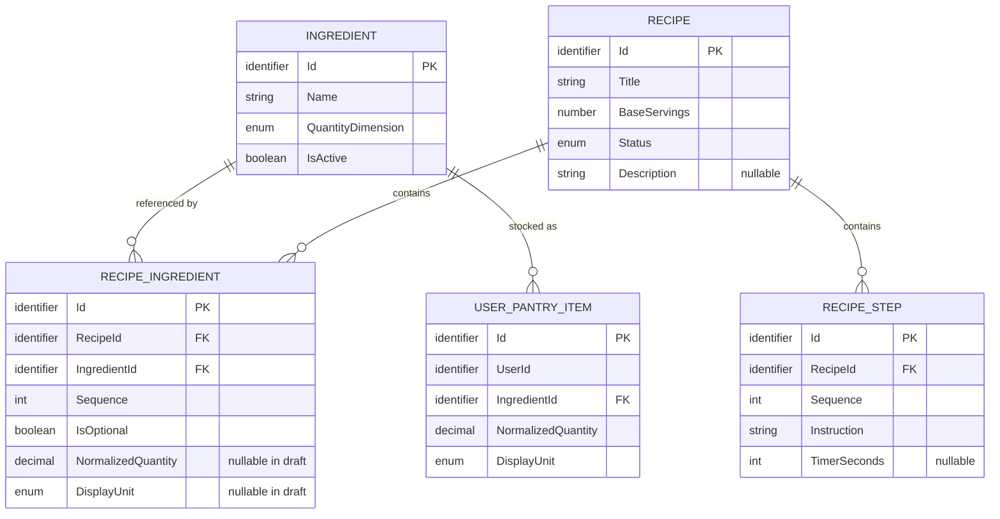
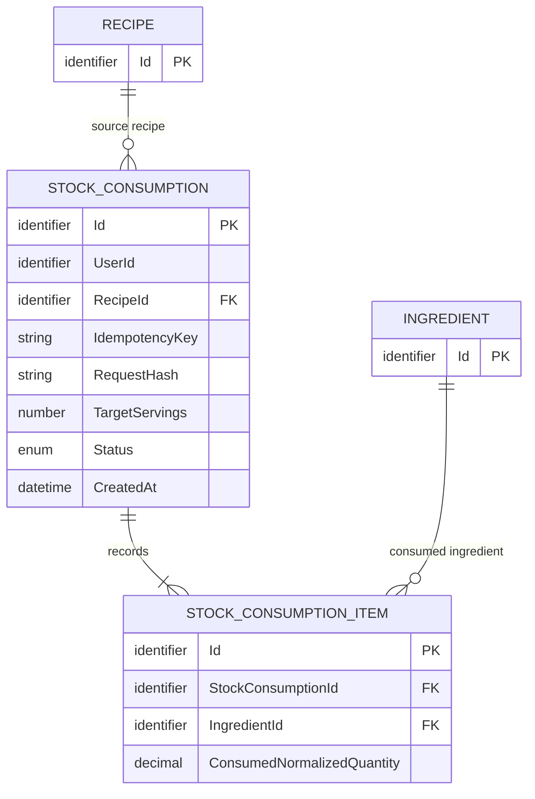

# Initial Domain and Data Model

## Amaç ve kapsam

Bu belge, Issue #7 kapsamındaki ilk domain ve veri modeli kararlarını tanımlar. Core model; ingredient kataloğu, tarifler ve kullanıcı kileri için gerekli en küçük veri kümesidir. Stok tüketimi için değerlendirilen kalıcı yapılar core modelden ayrı bir candidate extension olarak gösterilir.

Bu belge EF Core entity configuration veya migration değildir. Fiziksel implementation sonraki issue'larda yapılacaktır.

## Miktar modelinin temeli

Miktarın tek doğruluk kaynağı `NormalizedQuantity` alanıdır. Kullanıcının tercih ettiği gösterim birimi `DisplayUnit` olarak saklanır. Gösterilecek sayısal değer normalize miktardan güvenilir dönüşümle üretilir.

```text
NormalizedQuantity = 1000 g
DisplayUnit = kg
UI = 1 kg
```

`DisplayQuantity` persist edilmez. Böylece iki miktarın birbirinden kopması önlenir. Kullanıcının `1.000 kg` gibi lexical yazım biçiminin aynen korunması hedeflenmez; matematiksel değer ile birim tercihi korunur.

`NormalizedUnit` kolonu da gerekli değildir. Temel birim `Ingredient.QuantityDimension` üzerinden tek anlamlı biçimde türetilir:

- `Mass -> g`
- `Volume -> ml`
- `Count -> adet`

## Unit

Unit, MVP'de entity veya veritabanı tablosu değildir. Domain'de enum benzeri kapalı bir value object'tir.

| Unit | QuantityDimension | Base unit | Base unit conversion factor |
| --- | --- | --- | ---: |
| `g` | `Mass` | `g` | 1 |
| `kg` | `Mass` | `g` | 1000 |
| `ml` | `Volume` | `ml` | 1 |
| `l` | `Volume` | `ml` | 1000 |
| `adet` | `Count` | `adet` | 1 |

Unit'in tablo yapılmama nedenleri:

- Desteklenen beş değer kullanıcı tarafından yönetilen veri değildir.
- Yeni Unit eklemek yalnızca veri eklemek değildir; conversion ve validation davranışını değiştirir.
- Unit'in bağımsız CRUD veya yaşam döngüsü yoktur.
- Kapalı bir domain tipi geçersiz birimlerin sisteme girmesini daha erken engeller.
- “Bardak” gibi gelecekteki ölçüler malzemeye bağlı dönüşüm gerektirebilir ve basit bir Unit tablosuyla güvenilir biçimde çözülemez.

Yalnız aynı `QuantityDimension` içindeki exact dönüşümler yapılır. Kütle-hacim, kütle-adet veya hacim-adet arasında tahmin yapılmaz. Doğrulanmış dönüşüm yoksa hesap “değerlendirilemedi” sonucuna gider.

## Decimal precision ve hesaplama

Miktar alanlarının mevcut veri modeli kararı SQL Server `decimal(18,6)`, C# karşılığı `decimal` kullanmaktır.

Bu seçim:

- 12 tam sayı ve 6 kesir basamağı sağlar,
- mutfak miktarları için geniş bir aralık sunar,
- gram, mililitre ve adet tabanında küçük kesirleri saklar,
- exact `x1000` dönüşümlerini binary floating-point hatası olmadan destekler,
- porsiyon ölçeklemesinden doğabilecek ara kesirler için alan bırakır.

Bu karar gerçek implementation ve test kanıtı farklı gereksinim gösterirse ADR/değişiklik süreciyle revize edilebilir.

Hesaplama kuralları:

- C# hesaplarında `decimal` kullanılır; miktar için `float` veya `double` kullanılmaz.
- Intermediate calculation sırasında gereksiz rounding yapılmaz.
- API/input tarafında en fazla 6 kesir basamağı açıkça doğrulanır.
- Normalize edildiğinde `decimal(18,6)` aralığını aşan giriş reddedilir.
- Kullanıcı girdisi persistence sırasında sessizce yuvarlanmaz veya kesilmez.
- Hesaplanan bir değer persistence scale'ini aşarsa tek ve belgelenmiş bir rounding politikası gerekir.

Kesin rounding modu henüz seçilmemiş açık karardır.

Ürün brifi hedef porsiyona göre ölçeklemeyi ister fakat kesirli porsiyonu açıkça zorunlu kılmaz. Yalnız tam porsiyon desteklenirse pozitif integer; kesirli porsiyon onaylanırsa `decimal(9,3)` adaydır. Porsiyonun fiziksel veri tipi açık karardır.

## Core entity'ler

### Ingredient

**Sorumluluk:** Tarif ve kiler kayıtlarının referans verdiği kanonik malzemeyi ve miktar boyutunu tanımlar.

| Alan | Null olabilir mi? | Açıklama |
| --- | --- | --- |
| `Id` | Hayır | Kararlı kimlik; fiziksel tip implementation kararıdır. |
| `Name` | Hayır | Kullanıcıya gösterilen ad. |
| `QuantityDimension` | Hayır | `Mass`, `Volume` veya `Count`. |
| `IsActive` | Hayır | Yeni kullanım için aktiflik durumu. |

`NormalizedName` mevcut core domain modelinin parçası değildir. Ingredient adı için canonical lookup key veya normalization stratejisi; Unicode normalization, casing, localization ve SQL collation kararları kesinleşmeden persist edilen zorunlu bir alan ya da unique constraint olarak kabul edilmez.

**Sahiplik ve ilişkiler:** Catalog tarafından sahiplenilir. Bir Ingredient sıfır veya daha fazla RecipeIngredient ve UserPantryItem tarafından referanslanabilir.

**DB-level constraint adayları:**

- `Name` boş olamaz.
- `QuantityDimension` desteklenen kapalı kümede olmalı.

**Domain/Application kuralları:**

- MVP'de bir Ingredient tek bir QuantityDimension ile ölçülür.
- Pasif Ingredient yeni tarif/kiler girişinde seçilemez; mevcut referansların yaşam döngüsü ayrıca yönetilir.

### Recipe

**Sorumluluk:** Tarif kimliğini, temel porsiyonu, yayın durumunu ve genel tarif metadatasını taşır.

| Alan | Null olabilir mi? | Açıklama |
| --- | --- | --- |
| `Id` | Hayır | Kararlı tarif kimliği. |
| `Title` | Hayır | Tarif başlığı. |
| `BaseServings` | Hayır | Malzeme miktarlarının ait olduğu pozitif temel porsiyon. Fiziksel tipi açık karardır. |
| `Status` | Hayır | En az `Draft` ve `Published` durumlarını içeren kapalı değer. |
| `Description` | Evet | İsteğe bağlı açıklama. |
| Süre alanları | Evet | Verilirse negatif olamaz. |
| Kaynak/lisans metadatası | Taslakta evet | Yayın politikası ayrıca doğrulanır. |

**Sahiplik ve ilişkiler:** Recipes tarafından sahiplenilir. Sıfır veya daha fazla RecipeIngredient ve RecipeStep içerir. Published durumu için gerekli minimum çocuk kayıtlar Domain/Application seviyesinde doğrulanır.

**DB-level constraint adayları:**

- `Title` boş olamaz.
- `BaseServings > 0`.
- Süre verildiyse `>= 0`.
- `Status` desteklenen kapalı kümede olmalı.

**Domain/Application kuralları:** Publish readiness kontrolleri aşağıdaki ayrı bölümde tanımlanır.

### RecipeIngredient

**Sorumluluk:** Bir tarifin belirli Ingredient gereksinimini, tarif içi sırasını ve opsiyonellik durumunu tanımlar.

| Alan | Null olabilir mi? | Açıklama |
| --- | --- | --- |
| `Id` | Hayır | Satır kimliği. |
| `RecipeId` | Hayır | Sahibi olan Recipe. |
| `IngredientId` | Hayır | Referans verilen Ingredient. |
| `Sequence` | Hayır | Tarif içindeki pozitif sıra. |
| `IsOptional` | Hayır | Uygunluk ana sonucuna katılıp katılmayacağını belirler. |
| `NormalizedQuantity` | Taslakta evet | `BaseServings` için temel birimde miktar. |
| `DisplayUnit` | Taslakta evet | Gösterim tercihi olan kapalı Unit değeri. |

**Sahiplik ve ilişkiler:** Recipe aggregate'ine aittir. Her satır tam bir Recipe ve bir Ingredient'a referans verir. Aynı Ingredient farklı hazırlama amaçlarıyla aynı tarifte birden fazla satırda bulunabilir.

**DB-level constraint adayları:**

- `Sequence > 0`.
- `(RecipeId, Sequence)` unique.
- `NormalizedQuantity` ve `DisplayUnit` birlikte null veya birlikte dolu.
- Miktar doluysa `NormalizedQuantity > 0`.
- `DisplayUnit` desteklenen kapalı kümede olmalı.

**Domain/Application kuralları:**

- DisplayUnit boyutu, Ingredient.QuantityDimension ile eşleşmeli.
- Published Recipe içindeki zorunlu satırın miktar ve birimi eksiksiz olmalı.
- Opsiyonel satır zorunlu uygunluk sonucunu bozmaz.

### RecipeStep

**Sorumluluk:** Tarifin sıralı pişirme talimatını ve varsa süre önerisini taşır.

| Alan | Null olabilir mi? | Açıklama |
| --- | --- | --- |
| `Id` | Hayır | Adım kimliği. |
| `RecipeId` | Hayır | Sahibi olan Recipe. |
| `Sequence` | Hayır | Pozitif adım sırası. |
| `Instruction` | Hayır | Boş olmayan talimat. |
| `TimerSeconds` | Evet | Verilirse pozitif süre. |

**Sahiplik ve ilişkiler:** Recipe aggregate'ine aittir. Her RecipeStep tam bir Recipe'ye bağlıdır.

**DB-level constraint adayları:**

- `(RecipeId, Sequence)` unique.
- `Sequence > 0`.
- `Instruction` boş olamaz.
- `TimerSeconds` verildiyse `> 0`.

**Domain/Application kuralları:** Published Recipe'nin en az bir geçerli adımı olmalıdır. Timer'ın çalışma veya persistence yeri bu entity tarafından belirlenmez.

### UserPantryItem

**Sorumluluk:** Bir kullanıcının belirli Ingredient için mevcut toplam stok miktarını taşır.

| Alan | Null olabilir mi? | Açıklama |
| --- | --- | --- |
| `Id` | Hayır | Kiler satırı kimliği. |
| `UserId` | Hayır | Doğrulanmış kullanıcıya ait opaque kimlik. |
| `IngredientId` | Hayır | Stoktaki Ingredient. |
| `NormalizedQuantity` | Hayır | Ingredient boyutunun temel birimindeki tek otoritatif miktar. |
| `DisplayUnit` | Hayır | Kullanıcının gösterim tercihi. |

**Sahiplik ve ilişkiler:** Pantry tarafından ve mantıksal olarak `UserId` ile belirtilen kullanıcı tarafından sahiplenilir. Her satır bir Ingredient'a referans verir. Fiziksel User tablosu bu modelde varsayılmaz.

**DB-level constraint adayları:**

- `(UserId, IngredientId)` unique; bu kural stok partileri MVP dışında olduğu sürece geçerlidir.
- `NormalizedQuantity > 0`.
- `DisplayUnit` desteklenen kapalı kümede olmalı.
- Kullanıcı kilerini listelemek için `UserId` index'i.

**Domain/Application kuralları:**

- `DisplayUnit.Dimension`, Ingredient.QuantityDimension ile eşleşmeli.
- UserId route veya body'den alınmaz; doğrulanmış kullanıcı context'inden gelir.
- Okuma ve yazma sorguları kullanıcı kapsamında çalışır:

```text
Id = requestedId AND UserId = currentUserId
```

- Önce yalnız `Id` ile yükleyip sonra sahiplik kontrolü yapılmaz.
- Başka kullanıcıya ait kayıt için veri varlığını sızdırmayan `404 Not Found` yaklaşımı tercih edilir.
- Eşzamanlı değişiklik daha yeni veriyi sessizce ezemez; stok güncellemelerinde optimistic concurrency davranışı gereklidir.
- Bu davranışın fiziksel mekanizması (`rowversion`, başka bir version token yaklaşımı veya eşdeğeri) sonraki EF Core / SQL Server implementation issue'sunda kesinleştirilecektir.

## Core ERD

Unit bir tablo olmadığı ve fiziksel User tablosu henüz kararlaştırılmadığı için ERD'de entity olarak gösterilmez. Kullanıcı sahipliği `UserPantryItem.UserId` ile mantıksal olarak ifade edilir.



## Recipe publish invariant

### Row-local DB constraint'leri

Veritabanı seviyesinde tek satır veya standart unique/FK yapısıyla uygulanabilecek kurallar:

- Pozitif miktar ve sıra değerleri.
- Miktar ile DisplayUnit'in birlikte null/dolu olması.
- Desteklenen enum değerleri.
- Recipe içindeki sequence tekilliği.
- RecipeIngredient'ın Recipe ve Ingredient referans bütünlüğü.

### Domain/Application publish readiness

Recipe `Published` durumuna geçirilirken:

- en az bir geçerli adımı bulunmalı,
- bütün zorunlu RecipeIngredient satırları bir Ingredient ile eşleşmeli,
- bütün zorunlu satırlarda miktar ve Unit eksiksiz olmalı,
- DisplayUnit ile Ingredient boyutu uyumlu olmalı,
- miktar güvenilir biçimde normalize edilmiş olmalı,
- belirlenen kaynak/lisans yayın politikası sağlanmalı.

Standart bir SQL CHECK constraint, Recipe.Status değerine bakarak farklı tablodaki bütün RecipeIngredient satırlarının eksiksizliğini doğrulayamaz. Bu cross-entity invariant Domain/Application seviyesinde publish use case'i tarafından uygulanır ve otomatik testlerle korunur. Bu belge database trigger önermemektedir.

## Serving scaling ve suitability

RecipeIngredient.NormalizedQuantity, Recipe.BaseServings için gereken miktardır. Hedef porsiyon için gereken miktar C# `decimal` hesabıyla şu şekilde elde edilir:

```text
requiredNormalizedQuantity =
    RecipeIngredient.NormalizedQuantity
    * TargetServings
    / Recipe.BaseServings
```

Yalnız zorunlu ingredient satırları ana uygunluk sonucunu etkiler. Opsiyonel ingredient eksik veya yetersizse ana sonucu bozmaz; kullanıcıya ayrıntı olarak gösterilebilir.

Sonuçlar:

- **Yapılabilir:** Bütün zorunlu ingredient'lar mevcut, karşılaştırılabilir ve yeterlidir.
- **Miktar yetersiz:** Bütün zorunlu ingredient'lar vardır; en az birinin miktarı gereken miktardan düşüktür.
- **Eksik malzeme:** En az bir zorunlu ingredient kilerde yoktur.
- **Değerlendirilemedi:** Zorunlu bir satır güvenilir biçimde eşleştirilemez, miktarı eksiktir veya dönüşümü güvenilir değildir.

Eksik ve yetersiz malzeme birlikteyse ana sonuç **Eksik malzeme** olur; ayrıntıda iki sorun da gösterilir.

“Değerlendirilemedi” ile bilinen eksik/yetersiz durumların aynı tarifte birlikte bulunması halinde ana sonuç önceliği henüz kesin değildir. Bu bir açık ürün kararıdır; implementation varsayım yapmamalıdır. Hiçbir belirsiz durumda tarif kesin olarak “Yapılabilir” gösterilmez.

## Transactional stock consumption candidate extension

Bu bölüm core modelin parçası değildir. `StockConsumption` ve `StockConsumptionItem`, idempotent tüketim ve denetim izi için candidate extension'dır. İlk EF Core migration'ın otomatik kapsamı değildir; kesin alanları ve saklama politikası sonraki implementation issue'sunda ayrıca onaylanmalıdır.

### Business invariants

- Stok yalnız explicit user confirmation sonrasında azaltılır.
- Tüketim atomiktir: bütün ilgili stoklar güncellenir veya hiçbiri güncellenmez.
- Aynı mantıksal onayın stok üzerindeki etkisi en fazla bir kez gerçekleşir.
- Stok negatif olamaz.
- Yalnız kaydın sahibi stok tüketebilir.
- Concurrency conflict daha yeni veriyi sessizce ezemez.
- Aynı isteğin idempotent retry'ı ikinci bir stok etkisi oluşturmaz.

Bu davranışlar Domain/Application gereksinimidir ve belirli bir veritabanı mekanizmasına bağlı değildir.

### SQL Server / EF Core implementation adayları

- Tek SQL transaction.
- `(UserId, IdempotencyKey)` unique constraint.
- Aynı anahtarın farklı payload ile kullanımını algılayan request hash.
- SQL Server `rowversion` ile optimistic concurrency.
- EF Core concurrency exception handling.
- Açıkça seçilmiş transaction isolation seviyesi ve sınırlı retry davranışı.
- Tamamlanan sonucu tekrar döndürebilecek kalıcı consumption kaydı.

`rowversion` Domain zorunluluğu değildir; SQL Server için implementation adayıdır. Domain yalnız eşzamanlı değişikliğin sessizce ezilememesini talep eder.

### Candidate-extension ERD



Bu diyagram önerilen yönü gösterir; tablo ve kolonların kesin varlığını taahhüt etmez.

## Karar sınıflandırması

### Kesin kararlar

- Unit kapalı bir domain value object'idir; tablo değildir.
- `NormalizedQuantity`, persist edilen tek miktar doğruluk kaynağıdır.
- `DisplayUnit` persist edilir; display miktarı türetilir.
- Normalized temel birim Ingredient.QuantityDimension üzerinden türetilir.
- Boyutlar arasında tahmini dönüşüm yapılmaz.
- Miktarlar için mevcut karar `decimal(18,6)` ve C# `decimal` kullanımıdır.
- Published Recipe hazırlığı cross-entity Domain/Application invariant'ıdır.
- UserPantryItem sorguları doğrulanmış kullanıcı kimliğiyle sınırlandırılır.
- Transactional consumption core ERD'den ayrı tutulur.

### Açık kararlar

- Ingredient name normalization ve canonical lookup key stratejisi; Unicode normalization, casing, localization ve SQL collation yaklaşımı EF/persistence PR'ından önce kesinleştirilmelidir.
- Kesin rounding modu.
- Fractional serving desteği ve porsiyon alanının fiziksel tipi.
- “Değerlendirilemedi” sonucunun karma durum önceliği.
- Tarif kaynak/lisans yayın politikasının ayrıntıları.
- Ingredient'ın gelecekte birden fazla QuantityDimension destekleyip desteklemeyeceği.
- Stok partileri ve consumption kayıtlarının saklama politikası.

### Implementation'a bırakılan kararlar

- Kimlik kolonlarının fiziksel tipi.
- Enum/value object değerlerinin SQL'de string veya numeric tutulması.
- EF Core mapping, constraint ve index isimleri.
- SQL Server `rowversion`, transaction isolation ve retry ayrıntıları.
- Candidate consumption tablolarının kesin şeması.
- Tam tükenen UserPantryItem satırının silinmesi veya başka biçimde ele alınması.

## İlgili belgeler

- [MVP ürün brifi](product-brief.md)
- [Backend mimarisi](backend-architecture.md)
- [ADR 0002: Normalized quantity](adr/0002-use-normalized-quantity-as-source-of-truth.md)
- [ADR 0003: Transactional ve idempotent stok tüketimi](adr/0003-require-transactional-idempotent-stock-consumption.md)
